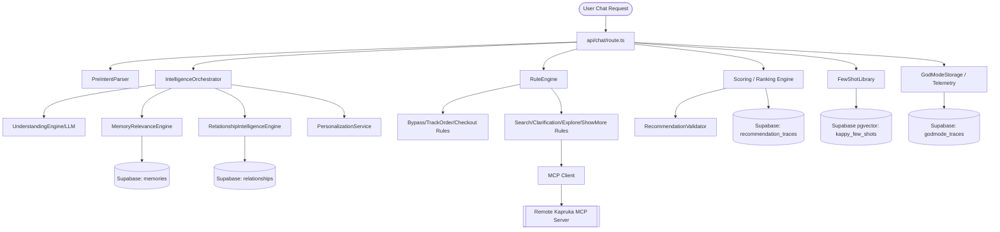

# KAPRUKA AI SYSTEM MAP

This document maps the entire Kapruka AI ("Kappy") architecture, detailng its core engines, database modules, API structures, MCP tools, and system dependencies.

---

## Dependency Graph & Core Architecture

---

## Module Directory

### 1. Decision & Intelligence Engines

| Module Name | File / Path | Purpose | Dependencies | Criticality | Risk Level | Status |
| :--- | :--- | :--- | :--- | :--- | :--- | :--- |
| **Pre-Intent Parser** | [preIntentParser.ts](file:///d:/Projects/Project%20-%20Kapruka/kapruka-ai/frontend/src/lib/intelligence/normalization/preIntentParser.ts) | Normalizes raw message phrases to standard intents via dictionaries. | Local dictionary file | CRITICAL | Low | **ACTIVE** |
| **Intelligence Orchestrator** | [intelligenceOrchestrator.ts](file:///d:/Projects/Project%20-%20Kapruka/kapruka-ai/frontend/src/lib/intelligence/orchestrator/intelligenceOrchestrator.ts) | Pipeline controller for the LLM understanding and personalization flow. | LLM client, Memory, Personality | CRITICAL | Medium | **ACTIVE** |
| **Rule Engine** | [ruleEngine.ts](file:///d:/Projects/Project%20-%20Kapruka/kapruka-ai/frontend/src/lib/intelligence/orchestrator/ruleEngine.ts) | Evaluates intent output against static rules to determine routing. | Base Rules | CRITICAL | Low | **ACTIVE** |
| **Scoring / Ranking Engine** | [scoring.ts](file:///d:/Projects/Project%20-%20Kapruka/kapruka-ai/frontend/src/lib/scoring.ts) | Scores candidate products using user profile, context, and affinities. | DB queries, Vector affinities | HIGH | Medium | **ACTIVE** |
| **Recommendation Validator** | [recommendationValidator.ts](file:///d:/Projects/Project%20-%20Kapruka/kapruka-ai/frontend/src/lib/recommendationValidator.ts) | Validates recommendations against rules and user profile parameters. | Validation rules | HIGH | Low | **ACTIVE** |
| **Occasion Engine** | [occasionEngine.ts](file:///d:/Projects/Project%20-%20Kapruka/kapruka-ai/frontend/src/lib/occasionEngine.ts) | Suggests permanent and seasonal occasions (e.g. Avurudu, Christmas). | None | MEDIUM | Low | **ACTIVE** |
| **Circuit Breaker** | [circuitBreaker.ts](file:///d:/Projects/Project%20-%20Kapruka/kapruka-ai/frontend/src/lib/intelligence/services/circuitBreaker.ts) | Degrades system behavior gracefully if database latency spikes or crashes occur. | DB Client | MEDIUM | Low | **ACTIVE** |

### 2. Personalization & Memory Services

| Module Name | File / Path | Purpose | Dependencies | Criticality | Risk Level | Status |
| :--- | :--- | :--- | :--- | :--- | :--- | :--- |
| **Memory Relevance Engine** | [relevanceEngine.ts](file:///d:/Projects/Project%20-%20Kapruka/kapruka-ai/frontend/src/lib/intelligence/memory/relevanceEngine.ts) | Retrieves and ranks conversation memories by similarity and context. | DB memories | HIGH | Medium | **ACTIVE** |
| **Memory Decay Engine** | [decayEngine.ts](file:///d:/Projects/Project%20-%20Kapruka/kapruka-ai/frontend/src/lib/intelligence/memory/decayEngine.ts) | Applies decay values to older memories based on elapsed time. | None | LOW | Low | **ACTIVE** |
| **Memory Conflict Resolver** | [conflictResolver.ts](file:///d:/Projects/Project%20-%20Kapruka/kapruka-ai/frontend/src/lib/intelligence/memory/conflictResolver.ts) | Resolves contradictions in user memory (e.g., preference switches). | None | MEDIUM | Low | **ACTIVE** |
| **Profile Normalizer** | [profileNormalizer.ts](file:///d:/Projects/Project%20-%20Kapruka/kapruka-ai/frontend/src/lib/intelligence/normalization/profileNormalizer.ts) | Standardizes profile, behavior, and preferences attributes. | DB Client | MEDIUM | Low | **ACTIVE** |
| **Behavior Profile Service** | [behaviorProfileService.ts](file:///d:/Projects/Project%20-%20Kapruka/kapruka-ai/frontend/src/lib/services/behaviorProfileService.ts) | Tracks interaction counts and price categories for behavioral signals. | Supabase client | MEDIUM | Low | **ACTIVE** |
| **Affinity Engine** | [user_affinities table] | Tracks category/brand affinity percentages based on user interactions. | Supabase client | MEDIUM | High | **DEAD CODE** |
| **Learning Engine** | [learning_events table] | Tracks learning events (e.g. feedback thumbs up/down, query patterns). | Supabase client | MEDIUM | High | **DEAD CODE** |

### 3. Observability & Telemetry

| Module Name | File / Path | Purpose | Dependencies | Criticality | Risk Level | Status |
| :--- | :--- | :--- | :--- | :--- | :--- | :--- |
| **God Mode Storage** | [storage.ts](file:///d:/Projects/Project%20-%20Kapruka/kapruka-ai/frontend/src/lib/intelligence/observability/godmode/storage.ts) | AsyncLocalStorage wrapper that accumulates telemetry traces. | Node.js | CRITICAL | Low | **ACTIVE** |
| **Trace Collector** | [traceCollector.ts](file:///d:/Projects/Project%20-%20Kapruka/kapruka-ai/frontend/src/lib/intelligence/observability/traceCollector.ts) | Standardizes and logs specific engine executions. | TraceStore | HIGH | Low | **ACTIVE** |
| **Trace Store** | [traceStore.ts](file:///d:/Projects/Project%20-%20Kapruka/kapruka-ai/frontend/src/lib/intelligence/observability/traceStore.ts) | Saves traces to Map and the `intelligence_traces` Supabase table. | Supabase client | HIGH | Low | **ACTIVE** |
| **Telemetry Service** | [telemetryService.ts](file:///d:/Projects/Project%20-%20Kapruka/kapruka-ai/frontend/src/lib/intelligence/observability/godmode/telemetryService.ts) | Emits runtime engine states and durations to the God Mode trace. | GodModeStorage | HIGH | Low | **ACTIVE** |

### 4. Database & Storage Modules

| Table Name | Purpose | Criticality | Risk Level | Status |
| :--- | :--- | :--- | :--- | :--- |
| **user_profiles** | User profile preferences (primary language, communication style, budget). | CRITICAL | Low | **ACTIVE** |
| **relationships** | Saved gift recipients and their relationships (mom, dad, nickname). | HIGH | Low | **ACTIVE** |
| **preferences** | Specific user preferences linked to relationships. | HIGH | Low | **ACTIVE** |
| **memories** | Contextual/general memories extracted from conversations. | HIGH | Low | **ACTIVE** |
| **orders** | Orders placed via the shopping pipeline. | HIGH | Low | **ACTIVE** |
| **recommendation_traces**| Tracks product recommendation metrics and pools. | MEDIUM | Low | **ACTIVE** |
| **search_sessions** | Caches raw search results for pagination. | MEDIUM | Low | **ACTIVE** |
| **stored_conversations** | Persists evaluated dialogue turns and test outcomes. | MEDIUM | Low | **ACTIVE** |
| **kappy_vocabulary** | Dictionary classifications of local vocabulary (Singlish/Tanglish). | HIGH | Low | **ACTIVE** |
| **kappy_few_shots** | Few-shot examples with vector embeddings for semantic matches. | CRITICAL | Low | **ACTIVE** |
| **godmode_traces** | Main God Mode telemetry and session summary table. | CRITICAL | Low | **ACTIVE** |
| **community_analytics** | Analytics for collaborative filtering / group trends. | MEDIUM | Low | **ACTIVE** |
| **intelligence_traces** | Log entries for individual engine steps. | HIGH | Low | **ACTIVE** |
| **user_affinities** | Affinity percentages for brands and categories. | LOW | High | **UNUSED STORAGE** |
| **learning_events** | Thumbs up/down, user corrections. | LOW | High | **UNUSED STORAGE** |
| **community_relevance_scores** | Precomputed relevance scores for community context. | MEDIUM | Low | **ACTIVE** |

### 5. MCP (Model Context Protocol) Tools

| Tool Name | Purpose | Criticality | Risk Level | Status |
| :--- | :--- | :--- | :--- | :--- |
| **kapruka_search_products**| Performs full-text search against Kapruka's product catalog. | CRITICAL | Low | **ACTIVE** |
| **kapruka_get_product** | Fetches detailed attributes of a specific product ID. | CRITICAL | Low | **ACTIVE** |
| **kapruka_list_categories**| Lists all product categories. | HIGH | Low | **ACTIVE** |
| **kapruka_list_delivery_cities** | Lists cities supported for delivery. | HIGH | Low | **ACTIVE** |
| **kapruka_check_delivery** | Verifies if a product can be delivered to a city. | CRITICAL | Low | **ACTIVE** |
| **kapruka_create_order** | Initiates order checkout and creation. | CRITICAL | Low | **ACTIVE** |
| **kapruka_track_order** | Tracks shipping status of an order. | CRITICAL | Low | **ACTIVE** |
