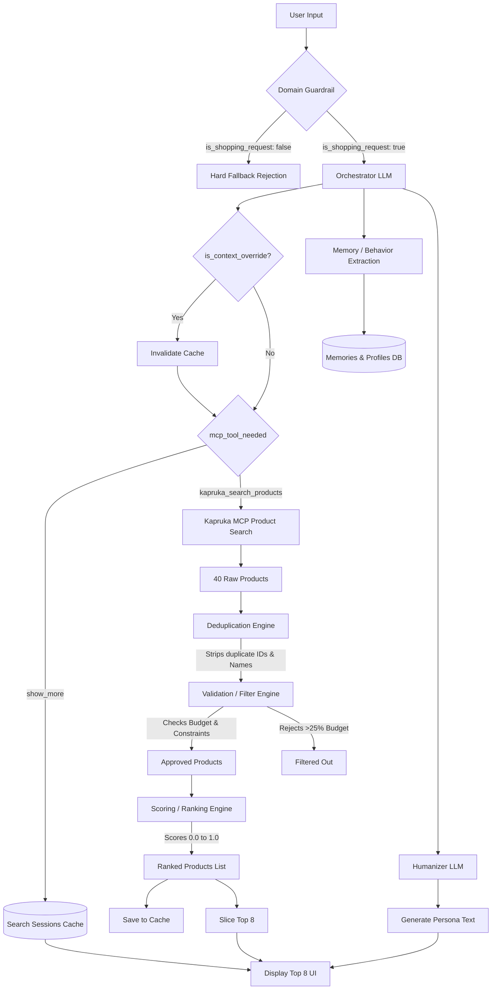

# Kappy AI: Complete System Architecture & Codebase Reference

This document serves as the absolute source of truth for the Kapruka Kappy AI Shopping Assistant project. It details the architecture, file structure, database schema, and the exact algorithms running the core intelligence.

---

## 1. System Architecture Overview

Kappy is built on a modern, edge-ready tech stack designed for speed, intelligent context retention, and strict domain control.

- **Frontend Framework**: Next.js 14+ (App Router)
- **UI Library**: React (with Tailwind CSS, Lucide Icons, and Framer Motion for animations)
- **Backend Infrastructure**: Next.js Edge APIs deployed on Vercel
- **Database**: Supabase (PostgreSQL) for relational state management
- **AI Brain**: OpenAI `gpt-4o-mini`
- **Data Integration**: Kapruka MCP (Model Context Protocol) connection for real-time product catalogs, order tracking, and stock checks.

---

## 2. Project Folder Structure

```text
kapruka-ai/
│
├── 01_create_recommendation_traces.sql   # Schema for AI diagnostics tracking
├── 02_create_search_sessions.sql         # Schema for V3 Pipeline Cache
├── v2_personalization_recommendation.sql # Schema for Profiles, Relationships, Memory
├── v3_conversations_dedup_migration.sql  # Schema updates for Chat History
├── documentations/                       # Prompt architectures and docs
│
└── frontend/
    ├── package.json
    ├── tailwind.config.ts
    └── src/
        ├── app/
        │   ├── api/chat/route.ts         # CORE API: The brain of Kappy
        │   ├── globals.css               # Global tailwind styles
        │   ├── layout.tsx                # App shell
        │   └── page.tsx                  # Main entry point UI
        │
        ├── components/
        │   ├── ChatMessage.tsx           # Renders AI texts, traces, and the Product Grid
        │   └── ChatWindow.tsx            # Main chat interface and input handler
        │
        └── lib/
            ├── masterPrompt.ts           # The Kappy System Prompt definitions
            ├── mcp.ts                    # Kapruka MCP connection layer
            ├── deduplication.ts          # Core deduplication algorithm
            ├── recommendationValidator.ts# Core filtering/validation engine
            ├── scoring.ts                # V2 Ranking Engine
            ├── bundle.ts                 # Algorithm for generating multi-product bundles
            ├── translation.ts            # Singlish/Tanglish query translator
            └── services/                 # Database interactors (Supabase)
                ├── behaviorProfileService.ts
                ├── chatHistoryService.ts
                ├── conversationsService.ts
                ├── memoryService.ts
                ├── personalizationService.ts
                ├── profileService.ts
                ├── searchSessionsService.ts
                └── shoppingJourneyService.ts
```

---

## 3. The Core Algorithms

### A. The V3 Recommendation Pipeline (The Orchestrator)
Located in `route.ts`. When a user sends a message, Kappy does NOT blindly search. It follows a multi-stage pipeline:



1. **Intent Extraction (Orchestrator LLM)**: Analyzes the user's message to extract `budget`, `recipient`, `occasion`, `shopping_stage`, and flags `is_context_override` if constraints changed.
2. **Domain Guardrail**: Checks `is_shopping_request`. If the user is asking about programming or math, it instantly blocks the request and skips all logic below.
3. **Memory Extraction**: Saves behavioral traits (e.g., "wife likes chocolate") into the `memories` table.
4. **Cache/Retrieval Strategy**: 
   - If the user asks for "more items" (`show_more`), it bypasses search and pulls from the `search_sessions` cache.
   - If `is_context_override` is true, the cache is wiped (`INVALIDATED`), and a fresh search happens.
5. **MCP Search**: Pulls 40 raw products from Kapruka's API based on context keywords (e.g., "girlfriend birthday").
6. **Deduplication Engine**: Runs to remove exact duplicates.
7. **Validation/Filter Engine**: Removes items that severely violate the budget (e.g., 25% over) or context.
8. **Scoring/Ranking Engine**: Sorts the surviving products based on multiple AI heuristics.
9. **Display Slice**: Slices the Top 8 products for the UI, caching the rest.
10. **Humanizer LLM**: A final, cheap LLM call to write the natural language response ("Ado! Here are some great items...").

### B. The Deduplication Algorithm
Located in `deduplication.ts`. Solves the issue where Kapruka's API returns the same product twice.
- **Priority 1**: Checks exact Product ID.
- **Priority 2**: Normalizes the Product Name (converts to lowercase, strips spaces/symbols) and checks for matches.
- **Priority 3**: Checks exact URL.
- **Bridging Fix (`route.ts`)**: Prevents duplicate IDs from re-entering the pipeline via the `seenIdsForScoring` Set filter.

### C. The Validation & Filtering Engine
Located in `recommendationValidator.ts`. Acts as a strict gatekeeper.
- **Budget Filtering**: Rejects items > 25% above the target budget. Allows cheaper items.
- **Keyword Filtering**: If `userIntent` includes negative keywords, it rejects them.
- **Clinical/Utility Filtering**: Blocks boring utility items (e.g., "blood pressure monitor") if the user is looking for a romantic gift.

### D. The Scoring (Ranking) Engine V2
Located in `scoring.ts`. Scores products from 0.0 to 1.0. 
- **Intent Match (35%)**: Does the product name/category match the query keywords?
- **User Preferences (15%)**: Does this product align with saved database traits for this recipient?
- **Budget Match (25%)**: Is the price perfectly clustered near the target budget?
- **Occasion Relevance (15%)**: Hardcoded keyword matches (e.g., "rose" + "anniversary").
- **Purchase History (10%)**: Has the user bought from this category before?

### E. Context Override & State Synchronization
Located in `route.ts`. 
- If a user changes a parameter (e.g., "actually my budget is 9000"), the Orchestrator flags `is_context_override: true`.
- **The rule:** It wipes the old cache in `search_sessions`.
- **Query Rule:** The Orchestrator is forbidden from searching "9000" on the MCP API, and instead searches the core concepts ("gift") while passing 9000 strictly to the Filter Engine.

---

## 4. Key Database Architecture (Supabase)

1. **`users` / `profiles`**: Stores the global `average_budget`.
2. **`relationships`**: Stores who the user buys for (`mother`, `girlfriend`).
3. **`preferences`**: Maps to relationships (e.g., "Wife" -> "Likes Cake").
4. **`memories`**: Raw text notes for the LLM context injector.
5. **`conversations` & `messages`**: Long-term chat retention.
6. **`shopping_journeys`**: Tracks where the user is in the funnel (e.g., `discovery` -> `consideration` -> `checkout`).
7. **`search_sessions`**: The high-speed pagination cache. Stores raw JSON arrays of remaining products so "show more" doesn't cost an API call.
8. **`recommendation_traces`**: The diagnostic telemetry table tracking how many items were retrieved, deduped, and filtered per query.

---

## 5. UI/UX Implementations

- **Dynamic Product Grid**: Handled in `ChatMessage.tsx`. Renders up to 8 products using a modern CSS Grid layout that is fully responsive.
- **Debug Trace Panel**: Available in `ChatMessage.tsx`. Visualizes the entire backend pipeline (Retrieved -> Deduped -> Filtered -> Ranked) and alerts developers when a `CONTEXT OVERRIDE` has occurred.
- **Strict Height Constraints**: Solved an initial UI bug where items dragged out of the window. Utilizes `h-full` and `overflow-y-auto` strictly inside nested containers instead of `100dvh`.
